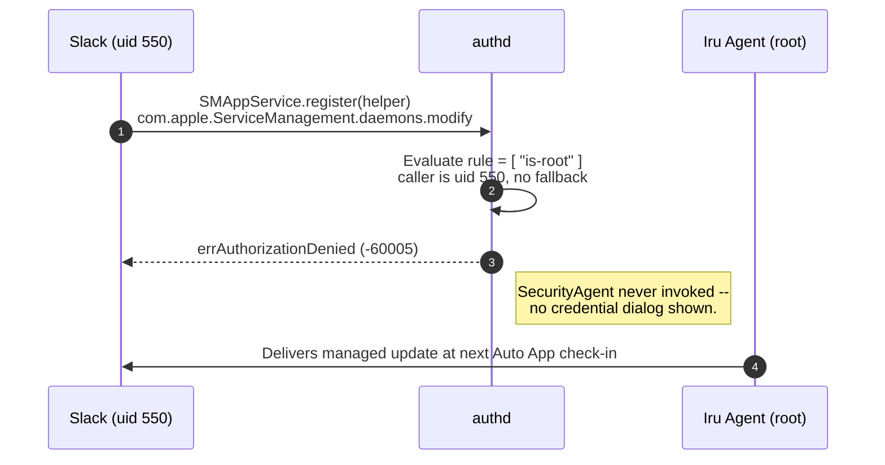

# Suppress Update Helper Tools

Tools for [suppressing update helper tool prompts](https://docs.iru.com/en/endpoint/library/auto-apps/suppressing-helper-tool-installation-prompts) in macOS.

## Overview

This project provides tools and configurations to suppress automatic updates for various third-party apps commonly used in enterprise environments.

It consists of two components:

- **App Update Helper Tool Prompt Suppression** - Suppresses the underlying `SMAppService` authorization prompt that helper tools depend on.
- **App-Specific Update Management** - A mobile configuration profile that disables in-app updates for titles that support Apple-native configuration keys.

## Components

### Update Helper Tool Prompt Suppression (`suppress_helper_prompts.zsh`)

> [!NOTE]
> This solution applies to any macOS app that triggers an admin credential prompt to add a new helper tool so it can apply a pending update. It may not cover every scenario, but it will prevent most update helper tool prompts.
>
> If your organization requires end users to enter administrator credentials to apply app updates outside the Auto Apps catalog, consider using tools such as [KAPPA](https://github.com/kandji-inc/KAPPA/), [kpkg](https://github.com/kandji-inc/kpkg), [AutoPkg](https://github.com/autopkg/autopkg), or [Installomator](https://github.com/Installomator/Installomator) to ensure updates are applied in accordance with organization policy.

The `suppress_helper_prompts.zsh` script modifies a single right (`com.apple.ServiceManagement.daemons.modify`) in the macOS authorization database so that non-root processes are silently denied before the helper prompt appears. Root processes (including the `mdmclient` and the `Iru Agent`) are not affected, and Iru continues to deliver settings and Auto App updates as expected.

#### Example flow for Slack with this script in scope

1. Logged-in user launches Slack
2. Slack prompts to add a helper tool to apply an update
3. authd checks `is-root`: fails (caller uid 550)
4. No fallback authentication rule exists
5. No dialog is shown to the user
6. Slack is updated via Iru's Auto App enforcement

#### Diagram showing the `authd` evaluation path

### App-Specific Update Management (`disable_aa_updates.mobileconfig`)

A custom mobile configuration profile that disables automatic updates for specific apps that support Apple-native configuration keys.

If there are apps in the list that are not currently under management in your environment, you can remove those configurations from the profile using a tool like `iMazing Profile Editor`.

The profile currently supports the following Auto App titles:

| App | Note |
|:-----|:------|
| 1Password 7 | Disables Sparkle update checks |
| 1Password 8 | Disables auto-updates |
| BBEdit | Disables automatic checks (but allows manual updates) |
| Brave Browser | Disables automatic update checks and installations |
| Claude | Disables auto-updates |
| CleanShot X | Disables update checks |
| Cursor | Disables auto-updates |
| Cyberduck | Disables Sparkle updater |
| Firefox | Disables app auto-updates via enterprise policies |
| Google Software Update | Disables Keystone auto-updates |
| Grammarly Desktop | Disables Sparkle updater |
| Handbrake | Disables Sparkle updater |
| Microsoft AutoUpdate | Disables Microsoft Office auto-updates |
| Microsoft OneDrive | Sets the sync app update ring to the Enterprise Tier, deferring automatic update enforcement by up to 60 days. ([Tier key](https://learn.microsoft.com/en-us/sharepoint/deploy-and-configure-on-macos#tier)) |
| NordLayer | Disables update checks |
| Opera | Disables auto-updates |
| RapidAPI (Paw) | Disables auto-updates |
| Slack | Disables auto-updates |
| Tailscale | Disables auto-updates |
| The Unarchiver | Disables update checks |
| Tunnelblick | Disables Sparkle updater |
| VLC | Disables Sparkle updater |
| VSCode | Disables auto-updates |
| Zoom | Disables automatic updates |

## Resources

- Additional `authdb` information - [authdb-helper-prompt-suppression](docs/authdb-helper-prompt-suppression.md)

