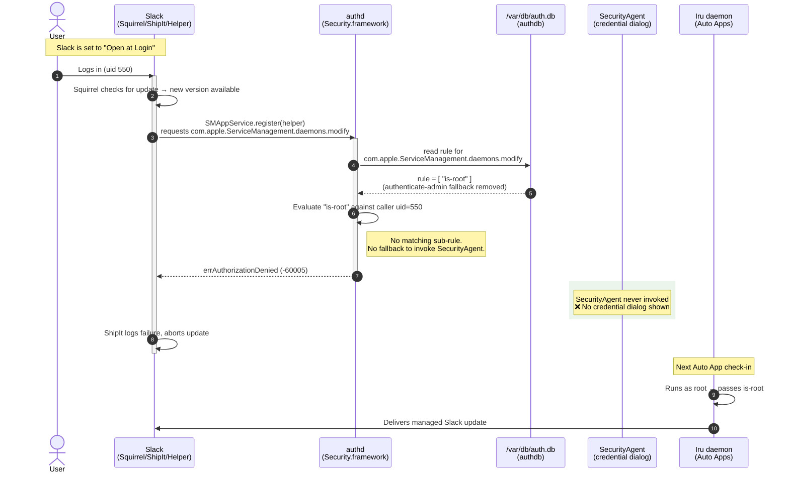

# macOS Authorization Database: Suppressing Privileged Helper Prompts

## Background

Many third-party apps (Slack, Cursor, Loom, Claude, Linear, ClickUp, etc.) ship with built-in updaters, like the [Squirrel.Mac](https://github.com/Squirrel/Squirrel.Mac) framework. When these apps detect a new version, the updater attempts to register a privileged background helper (sometimes called ShipIt or a framework helper) using `SMAppService` so it can install updates with elevated privileges, outside the app's sandbox.

Registering a system-level daemon via `SMAppService` requires the caller to hold the `com.apple.ServiceManagement.daemons.modify` authorization right. In the default macOS configuration, non-root users who don't already hold that right are prompted by SecurityAgent to authenticate with admin credentials. This is the source of the helper install credential dialogs that end users encounter.

In a managed environment where app updates are delivered exclusively through an MDM tool, these dialogs are noisy and the credential prompt only creates confusion.

This document provides additional background on the mechanism used to modify the macOS Authorization Database so that update helper tool prompts are suppressed.


## What the macOS Authorization Database Is

The authorization database (`/var/db/auth.db`) is a SQLite database managed by `authd`. It stores rules that define what a process must satisfy to be granted a given authorization right. Each right has a rule with one or more sub-rules (`is-root`, `allow`, `authenticate-admin`, etc.). When a process requests a right, `authd` evaluates the rule and either grants it, invokes SecurityAgent to collect credentials, or denies it.

Rights can be read and written using the `security authorizationdb` command-line tool:

```
# Read the current rule for a right
security authorizationdb read <right-name>

# Write a new rule (piped as a plist)
security authorizationdb write <right-name> < rule.plist
```

Writes require root.


## The Target Right: `com.apple.ServiceManagement.daemons.modify`

This right controls whether a process can register or modify system-level daemons via `SMAppService` (macOS 13+). This is the API that replaced `SMJobBless`. In practice, this is what triggers update-helper credential prompts.

### Default rule (Apple seed)

```xml
<?xml version="1.0" encoding="UTF-8"?>
<!DOCTYPE plist PUBLIC "-//Apple//DTD PLIST 1.0//EN" "http://www.apple.com/DTDs/PropertyList-1.0.dtd">
<plist version="1.0">
    <dict>
        <key>class</key>
        <string>rule</string>
        <key>comment</key>
        <string>Used by the ServiceManagement framework to make changes to the system launchd's set of daemons.</string>
        <key>k-of-n</key>
        <integer>1</integer>
        <key>rule</key>
        <array>
            <string>is-root</string>
            <string>entitled-admin-or-authenticate-admin-nonshared</string>
        </array>
        <key>version</key>
        <integer>1</integer>
    </dict>
</plist>
```

The `k-of-n` is 1, meaning only one sub-rule needs to match. For a non-root user process, `is-root` fails, so `authd` falls through to `entitled-admin-or-authenticate-admin-nonshared`. The sub-rule has a `builtin:authenticate` mechanism. This invokes SecurityAgent and presents the credential dialog.

### Modified rule (managed)

```xml
<?xml version="1.0" encoding="UTF-8"?>
<!DOCTYPE plist PUBLIC "-//Apple//DTD PLIST 1.0//EN" "http://www.apple.com/DTDs/PropertyList-1.0.dtd">
<plist version="1.0">
    <dict>
        <key>class</key>
        <string>rule</string>
        <key>comment</key>
        <string>Managed by Iru: restricted to root-only (is-root sub-rule). Removes entitled-admin-or-authenticate-admin-nonshared to prevent update helpers from triggering a credential prompt via SMAppService. Root processes (mdmclient, Iru daemon) are unaffected. Revert to the Apple default: right="com.apple.ServiceManagement.daemons.modify"; /usr/libexec/PlistBuddy -x -c "Print :rights:${right}" /System/Library/Security/authorization.plist | sudo security authorizationdb write ${right}</string>
        <key>k-of-n</key>
        <integer>1</integer>
        <key>rule</key>
        <array>
            <string>is-root</string>
        </array>
        <key>version</key>
        <integer>1</integer>
    </dict>
</plist>
```

With only `is-root` in the rule array, there is no fallback. A non-root process requesting this right silently receives `errAuthorizationDenied` (`-60005`) immediately. SecurityAgent is never invoked. No dialog appears.


## Evaluation Path



Root processes - `mdmclient`, package installers, the MDM agent daemon - pass `is-root` and are
unaffected.


## Persistence Behavior

The authorization database is stored on the data volume and persists across:

- Logout/login
- Lock/unlock
- Restarts
- Minor OS updates (e.g., 15.3 -> 15.4, 15.4 -> 15.5)
- **Major OS upgrades** - tested with macOS 15.7.4 -> macOS 26.4.1

### Post-upgrade verification (macOS 26.4.1, build 25E253):

The output below is from running `suppress_helper_prompts.zsh` after the macOS upgrade.

```
09:16:41 AM: [suppress_update_prompts] com.apple.ServiceManagement.daemons.modify already restricted to "is-root" only. No changes needed.
09:16:41 AM: [suppress_update_prompts] Done.
```

**Note:** While testing has shown the modification persists across a major upgrade (15 > 26),
Apple's policy seeding behavior is not formally documented and could change in future OS
releases. The "continuously enforce" delivery cadence is still recommended as a safety net.

### Recommendation

Set the Custom Script Library Item that delivers `suppress_helper_prompts.zsh` to **Continuously enforce** in the MDM tool. The script is idempotent; if the rule is already in the correct state, it logs and exits without writing. So continuous enforcement carries no cost and guards against any future OS seeding behavior that resets the right.

## Side Effects and Trade-offs

| Behavior | Impact |
|:---|:---|
| Non-root admin users cannot register system daemons via `SMAppService` without `sudo` | Expected in a managed environment; all daemon management flows through MDM/root |
| Squirrel-based or similar apps continue to open, run, and operate normally | Update installation via the helper silently fails; the managed update path is unaffected |
| First-party Apple daemons and MDM-enrolled tools are unaffected | They run as root and pass `is-root` |
| Reverting is a single command | See [Reverting to Apple Default](#reverting-to-apple-default) |


## Reverting to Apple Default

```zsh
right="com.apple.ServiceManagement.daemons.modify"; /usr/libexec/PlistBuddy -x -c "Print :rights:${right}" /System/Library/Security/authorization.plist | sudo security authorizationdb write ${right}
```

This restores the Apple-seeded default from the SIP-protected source of truth in `/System/Library/Security/authorization.plist`, writing the original `entitled-admin-or-authenticate-admin-nonshared` sub-rule back into `authd`.


## Affected Apps (Known)

Apps confirmed to trigger `com.apple.ServiceManagement.daemons.modify` via Squirrel/ShipIt/etc:

- Claude
- ClickUp
- Cursor
- Discord
- Figma
- Linear
- Loom
- NordLayer
- Notion
- Slack
- VSCode
- Zed

This list is representative, not exhaustive. Any app using `Squirrel.Mac` or a similar `SMAppService`-based update registration pattern will be affected.


## References

- [Squirrel.Mac Issue #192](https://github.com/Squirrel/Squirrel.Mac/issues/192) - upstream report of the credential dialog behavior
- `man security` - `authorizationdb` subcommand documentation
- Apple TN: [Authorization Services Programming Guide](https://developer.apple.com/documentation/security/authorization-services) - right evaluation model
- `SMAppService` - [`ServiceManagement` framework reference](https://developer.apple.com/documentation/servicemanagement/smappservice)
- Apple OSS Distributions / Security
    - [authorization.plist](https://github.com/apple-oss-distributions/Security/blob/db15acbe6a7f257a859ad9a3bb86097bfe0679d9/OSX/authd/authorization.plist#L289)
    - [authdb.c source](https://github.com/apple-oss-distributions/Security/blob/main/OSX/authd/authdb.c)
- [Managing the Authorization Database](https://derflounder.wordpress.com/2014/02/16/managing-the-authorization-database-in-os-x-mavericks/) - dated (2014) but provides useful background on the right evaluation model
