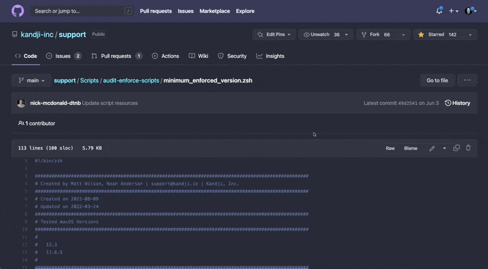

# Auto App Uninstallers

## Overview
This repository contains a number of uninstallers for Kandji Auto Apps.  Uninstallers for applications such as Parallels Desktop and VMware Fusion offer the ability to remove multiple versions.

**NOTE:** If multiple versions of an application are present, running the uninstaller may adversely affect other versions.

## Recommended Usage
When using the scripts in this repository, copy the entire script, including the first line with the #!, to ensure the code runs with the correct interpreter.

The easiest way to do this is:

1. Navigate to the script you would like to use.
2. Select the **Raw** button.
3. On the page that appears, copy all of the text.

**NOTE:** To modify which versions get uninstalled for applications such as Parallels or VMware, adjust the `versions_to_remove` array (located below the License information section) accordingly.  The array expects integer values, separated by a space if there are multiple values ex:`versions_to_remove=(15 17 18)`.

## Recommended Deployment

**NOTE:** It is *highly* recommended you remove the application from any Blueprints where this uninstaller is added.

* Run these Auto App uninstallers as a Custom Script with the code copied via the **Recommended Usage** section above pasted within the Audit Script section of the Custom Script Library item.
* Recommended execution frequency is **Run once per device**.

## Uninstall Methodology
1. Code will first kill any active application processes.
2. Next, if the application bundle exists in /Applications (and if it is the appropriate version), it will be deleted.
3. The script then iterates over all users with UID ≥ 500, populates their home directory paths, and confirms a user Library exists under the identified home directory by NFSHomeDirectory.
4. For users with valid user libraries, searches multiple paths for application preferences/files/folders and removes them if found, logging what's removed to stdout via echo.
5. Additional system level preferences/files/folders are removed and logged to stdout if applicable.