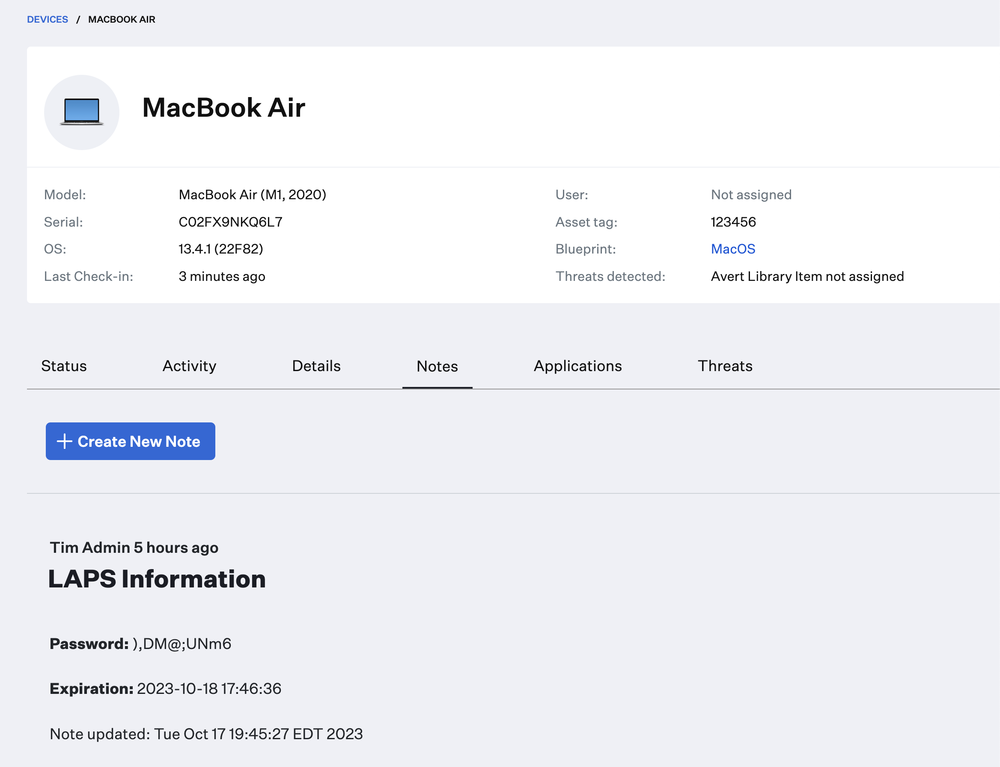
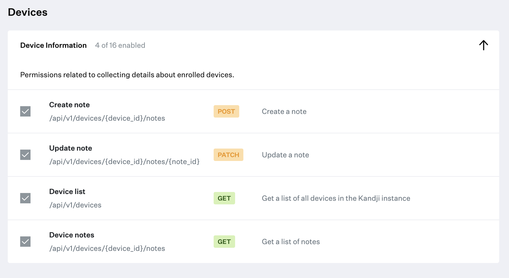

# LAPS Retriever
<!--- aka "LAPrador Retriever" --->

This supplementary script is designed to be deployed alongside [macOSLAPS](https://github.com/joshua-d-miller/macOSLAPS). It will retrieve the current LAPS password and expiration date. The script output is then written to the notes field in the device record in Kandji. This script is based on the `Password:Expiration Combined.zsh` example from the official macOSLAPS GitHub repo.

>**Note:** Password retrieval in macOSLAPS, by design, returns passwords in plaintext to the standard out of macOS. The LAPS Retriever script from Kandji does not modify or extend this functionality; it simply creates a note on the device record with the information requested.
>
>The same plaintext output can also be found on the status page of the Custom Script Library Item. Please ensure that this behavior aligns with your organization's security and compliance standards. Kandji shall not be held liable for any legal implications or breaches resulting from the use of macOSLAPS or its inherent behaviors.



## Requirements

* [macOSLAPS](https://github.com/joshua-d-miller/macOSLAPS) deployed via a Custom App Library item
* macOSLAPS Config Profile deployed via Custom Profile Library item. [iMazing Profile Editor](https://imazing.com/profile-editor) has an excellent template.
* This script ([lapsretriever.zsh](lapsretriever.zsh))
* An API token with the following permissions: Create Note, Update Note, Device List, and Device Notes.
* macOS 12.0 (Monterey) or higher
  
## Instructions

**Note:** These instructions assume you have already deployed macOSLAPS as a Custom App, and the appropriate Configuration Profile as a Custom Profile. The configuration profile is vital as it determines the account that needs to be rotated, and the parameters by which it makes that rotation. 

1. Generate an API token for this automation in the Kandji tenant with the following privileges:
   
  * Create note
  * Update note
  * Device list
  * Device notes

 

2. Download the [`lapsretriever.zsh`](lapsretriever.zsh) script. Edit the script and add your **kandji subdomain**, the **API token** you generated in step 1, and a **Note Title** in the `USER INPUT` section of the script.

```shell
##############################################################
# USER INPUT 
##############################################################

# Kandji Subdomain
subdomain="mycompany"

# Region (us and eu) - this can be found in the Kandji settings on the Access tab
region="us"

# API Bearer Token
token="your-token-here"

# Note Title
# You'll need to include a UNIQUE note title or specific piece of information from a note in order to grab it's UUID and continuously update it.
noteTitle="LAPS Information"
```

3. Create a new **Custom Script** Library item. Change the [icon](images/laprador_retriever.png) and name as desired, assign it to a Blueprint, and paste your code in.

4. Test and Validate before deploying to production. If you are rotating your LAPS password every two days, it would make sense to run this script daily.

## Considerations

* Note that both custom script library item output, as well as device Notes, are viewable by all [team member role types](https://support.kandji.io/support/solutions/articles/72000560512-team-member-role-permissions) in Kandji.
* If this script runs directly before the password is rotated, you can end up in a rare scenario where the password in the note is out of date until the script runs again (the next day, if you have the script set to daily). The password will be reflected properly the next time this script runs and fetches the newly changed password.

## Troubleshooting

* **How do I install macOSLAPS?**
  * Download the pkg and upload it as a Custom app library item. Follow the Getting Started guide on their [wiki](https://github.com/joshua-d-miller/macOSLAPS/wiki). It is vital that you also deploy a configuration profile via the Custom Profile Library Item.
* **I'm getting an error**
  * Double-check that you're using a valid API token with the correction permissions and that your Kandji subdomain is correct.
  * Make sure macOSLAPS is deployed and installed on the device, and that you've pushed a mobileconfig profile to the device to configure macOSLAPS.
  * Read the script output in the library item for further troubleshooting, or scrape the unified log on the device itself with `log show --process "logger" --style compact | grep LAPSRetriever`
* **How do I tell which account to fetch the password for?**
  * The admin account whose password is being rotated is defined by the configuration profile payload you deployed alongside macOSLAPS.
