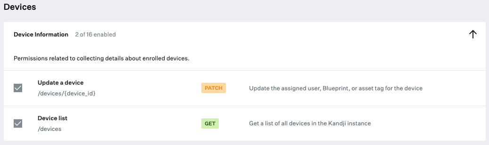

# assign-user-passport

This script is designed to automatically look for the IdP user who signed in with Passport and assign that user to the device record in Kandji. It will look up the IdP user in your Kandji tenant's user directory, and if a match is found, assign that user to the device record. By default, the script will search your full user directory. If you wish to only search a specific directory, please use the INTEGRATION_ID variable.

## Prerequisites

1. [Kandji API Token](https://support.kandji.io/kb/kandji-api) with List Users, Update a device, and Device list permissions.
</img>
2. [User Directory Integration](https://support.kandji.io/kb/user-directory-integration)
3. [jq](https://jqlang.github.io/jq). The script will check for, download, and install jq automatically for JSON parsing. If the script installs jq it will also delete it before exiting.
 
## Prepare the Script
 
1. Open the script in a text editor such as BBEdit or VSCode.
1. Update the User Input variables:
    1. Set `SUBDOMAIN` to your Kandji subdomain.
    1. Set `REGION` to match your tenant region (us or eu).
    1. Set `TOKEN` to your Kandji Enterprise API bearer token.
    1. Optional: Set `INTEGRATION_ID` to UUID of the user directory integration you want to search.
    ```Shell
    ##############################################################################
    ############################# USER INPUT #####################################
    ##############################################################################
    
    # Set your Kandji subdomain (example: for "beekeepr.kandji.io", enter "beekeepr")
    SUBDOMAIN="subdomain"

    # Set your region (example: "us" or "eu")
    REGION="us"

    # Kandji Enterprise API token
    TOKEN="API token goes here"

    # User Directory Integration UUID (leave blank to search all integrations)
    INTEGRATION_ID=""
    ```
3. Save and close the script.
4. In Kandji, create a new Custom Script.
5. Set a title and assign it to the correct Blueprint(s)
6. Set the execution frequency to Run once per device
7. Paste your modified assign-user-passport.zsh script in the body of the script
8. Click Save
