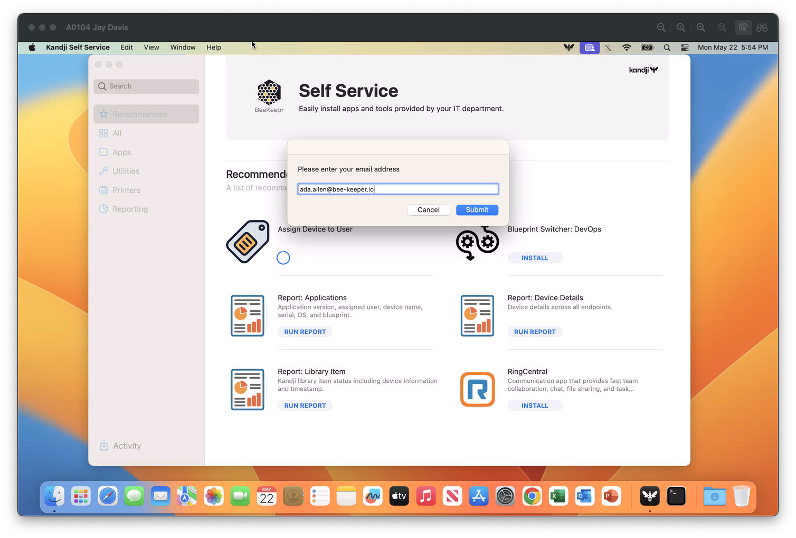
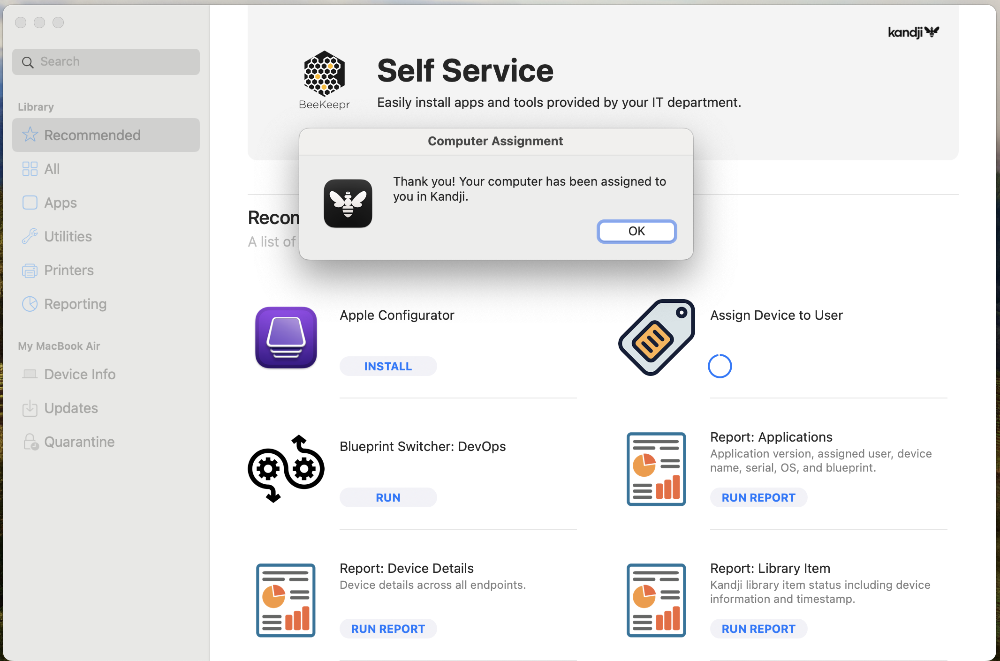
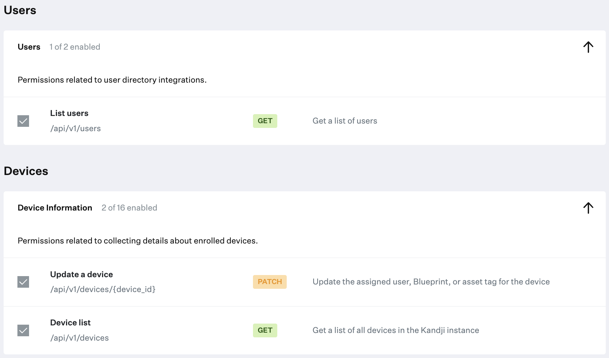

# assign-user-prompt

This script is designed to prompt a macOS end user for their email address. It will then look up their email against your Kandji tenant user directory, and if a viable match is found, assign that user to the device record. By default, the script will search your full user directory. If you wish to only search a specific directory, please use the INTEGRATION_ID variable.




While the intended use of this script was to be deployed via Kandji Self Service, there is no reason that in couldn't be run in another context. For example, [after Liftoff completes](https://github.com/kandji-inc/support/tree/main/Scripts/install-after-liftoff).

## Prerequisites

1. [Kandji API Token](https://support.kandji.io/support/solutions/articles/72000560412-kandji-api) with List Users, Update a device, and Device list permissions.
</img>
2. [User Directory Integration](https://support.kandji.io/support/solutions/articles/72000560544-user-directory-integration)
3. [jq](https://jqlang.github.io/jq). The script will check for, download, and install jq automatically for JSON parsing. If the script installs jq it will also delete it before exiting.
 
## Prepare the Script
 
1. Open the script in a text editor such as BBEdit or VSCode.
1. Update the User Input variables:
    1. Set `SUBDOMAIN` to your Kandji subdomain.
    1. Set `REGION` to match your tenant region (us or eu).
    1. Set `TOKEN` to your Kandji Enterprise API bearer token.
    1. Optional: Set `INTEGRATION_ID` to UUID of the user directory integration you want to search.

    ```Shell
    ##############################################################################
    ############################# USER INPUT #####################################
    ##############################################################################
    
    # Set your Kandji subdomain (example: for "beekeepr.kandji.io", enter "beekeepr")
    SUBDOMAIN="subdomain"

    # Set your region (example: "us" or "eu")
    REGION="us"

    # Kandji Enterprise API token
    TOKEN="API token goes here"

    # User Directory Integration UUID (leave blank to search all integrations)
    INTEGRATION_ID=""
    ```
1. Save and close the script.
1. In Kandji, create a new Custom Script Library Item.
1. Set a title and assign it to the Blueprint(s) you want the item to be a part of.
1. Set the execution frequency to "Run on-demand from Self Service" or your desired execution frequency.
1. Paste your modified assign-user-prompt.zsh script in the "Audit Script" section.
1. Click Save.


