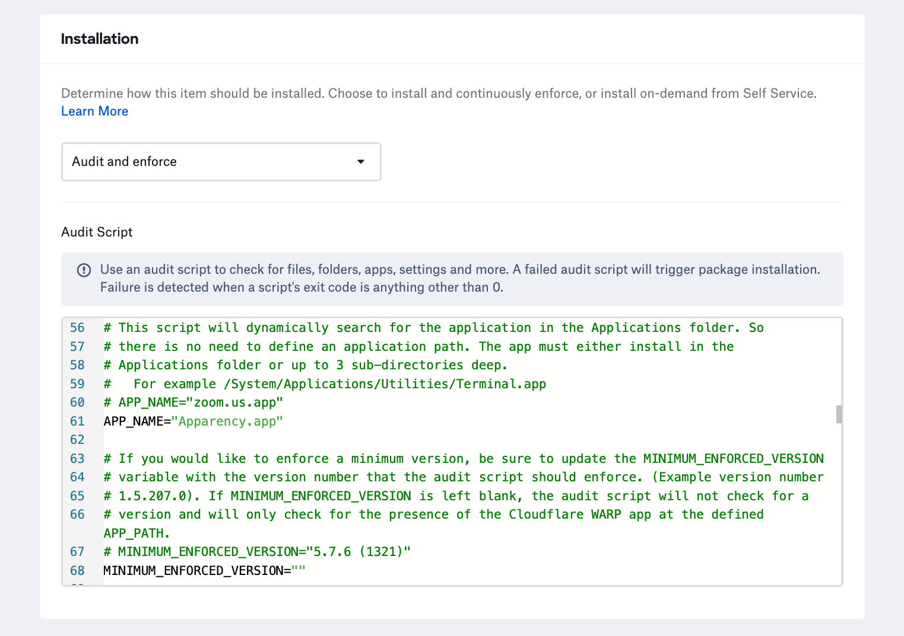

# README for scripts in the audit-enforce-scripts repo folder

### minimum\_enforced\_version

To use this script, copy the script contents to the audit and enforce text field in the Kandji Custom App Library Item. Then update the `APP_NAME` variable with the app's name as it would appear in the Applications folder on the Mac.

Optionally, you can add a `MINIMUM_ENFORCED_VERSION` that the script should look for and enforce. The app will only be installed from Kandji if the locally installed app version is lower than the minimum enforced version defined in the script.

#### Note on minimum\_enforced\_version and MSFT Office apps

For Microsoft Office, in particular, if you are using the full installer, you can put the name of one of the installer's apps. If you know that the suite installer should install Microsoft Word, you would just put `"Microsoft Word.app"` in the `APP_NAME` variable.
