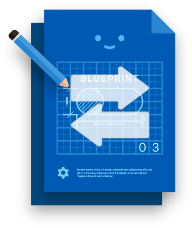
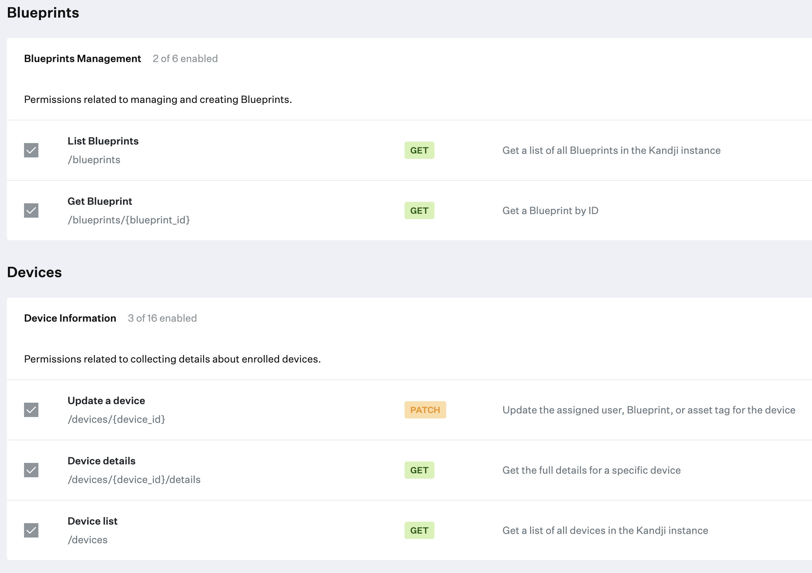
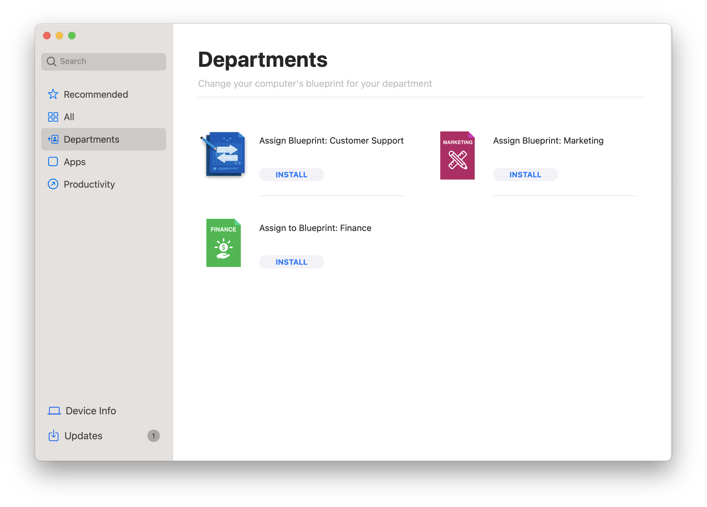
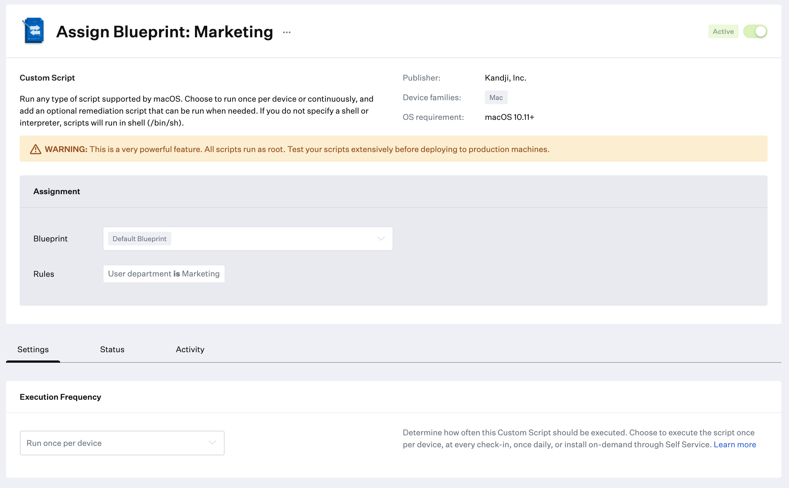

# Blueprint Switcher  

This script is designed to move Mac computers already enrolled into Kandji from one Blueprint to another.

## Requirements
* This script (`blueprint_switcher.zsh`)
* An API token with the following permissions:
  * List Blueprints
  * Get Blueprint
  * Update a Device
  * Device details
  * Device List
  

This script does not require any additional script libraries or dependencies.
  
## Instructions
1. Generate an API token for this automation in the Kandji tenant with the following privileges:
  * List Blueprints
  * Get Blueprint
  * Update a Device
  * Device details
  * Device List
2. Download the `blueprint_switcher.zsh` script. Edit the script and add your **kandji subdomain**, the **API token** you generated in step 1, and the **Blueprint name or UUID** you want the Mac assigned to in the `USER INPUT` section of the script.
```shell
##############################################################
# USER INPUT 
##############################################################

# Kandji Subdomain
subdomain="mycompany"

# Region (us and eu) - this can be found in the Kandji settings on the Access tab
region="us"

# API Bearer Token
token="your-token-here"

# Blueprint name/UUID (This is the name of the Blueprint as it exists in Kandji that you want to assign devices to).
assignBlueprint="MyBlueprint"
```
3. Create a new **Custom Script** Library item. Change the icon and name as desired, assign it to a Blueprint, and paste your code in.
4. Test and Validate before deploying to production.

## Icon
Here's an icon you can use if you'd like:


## Usage Examples

### Blueprint Switching via Self Service
In a situation where someone wants to assign all Mac computers to a default Blueprint and then have the end-user assign themselves to the appropriate department/role Blueprint via Self Service after they log in for the first time. (In cases where assignment via Identity Provider Group isn't available.)

This is also helpful for depot/warehouse scenarios where technicians may need to choose the intended purpose of a device (i.e. Kiosk Mac vs Caching Server) before shipping it to its final destination.

Create a Custom Script Library Item and enable it for Self Service, allowing the end-user or the IT admin configuring the Mac to click on the appropriate Department/Blueprint in Self Service to switch the enrolled Mac to that Blueprint.


### Blueprint Switching via Assignment Rules
Leverage Assignment Rules to automate switching of a Mac to a Blueprint based on IDP User Group, Department, or Job Title.
1. Add this script to a Custom Script Library item.
2. Assign it a Blueprint your Mac computers enroll into.
3. Edit the User Input section of the script with the appropriate details for the Blueprint you want the Mac switched to.



### Other
Any other scenario where you want to automate the switching of an enrolled Mac from one Blueprint to another. You can use it in a Library Item like in the examples above, where it will run locally on the Mac, or you can use the script on a VM for automation.
* One could leverage this script with some other logic to switch Blueprints based on any other available information (i.e. trigger after a certain criteria is met using audit scripts, etc)

## Troubleshooting
* **I'm getting an error**
  * Double-check that you're using a valid API token with the correction permissions and that your Kandji subdomain is correct.
  * Check the output logs in the library item in Kandji, or run `log show --style compact --process "logger" | grep "bp_switcher"` on the device that is running the script to view the logs.
  
<!---
=================================================================
       (      (               (                     )       (     
   (   )\ )   )\ )  (  (      )\ )  *   )   (    ( /(       )\ )  
 ( )\ (()/(  (()/(  )\))(   '(()/(` )  /(   )\   )\()) (   (()/(  
 )((_) /(_))  /(_))((_)()\ )  /(_))( )(_))(((_) ((_)\  )\   /(_)) 
((_)_ (_))   (_))  _(())\_)()(_)) (_(_()) )\___  _((_)((_) (_))   
 | _ )| _ \  / __| \ \((_)/ /|_ _||_   _|((/ __|| || || __|| _ \  
 | _ \|  _/  \__ \  \ \/\/ /  | |   | |   | (__ | __ || _| |   /  
 |___/|_|    |___/   \_/\_/  |___|  |_|    \___||_||_||___||_|_\  
================================================================= 
-->
