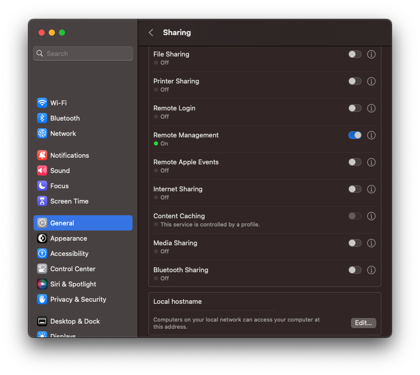

# enable-remote-management

This script is designed to automatically toggle on Remote Management for any macOS endpoint it is run on. This could be used to enable Remote Desktop for all devices in a particular blueprint, or could be executed via Self Service for a user-centric approach.

## Prerequisites

1. Kandji API Token with Update Device, Device List, and Remote Desktop permissions. For more infomation about setting up an API token, see [Kandji API Token](https://support.kandji.io/kb/kandji-api#generate-an-api-token)
2. JQ. The script will check for, download, and install JQ automatically in order to parse JSON. At the end of the script, JQ will be removed.
 
## Prepare the Script
 
Simply fill in the variables section of the script with the appropriate information from your Kandji tenant. Add the script as a Custom Script library item and choose your execution frequency.

## Notes

For more information about Remote Desktop on macOS, see: https://support.kandji.io/kb/turn-on-remote-desktop
