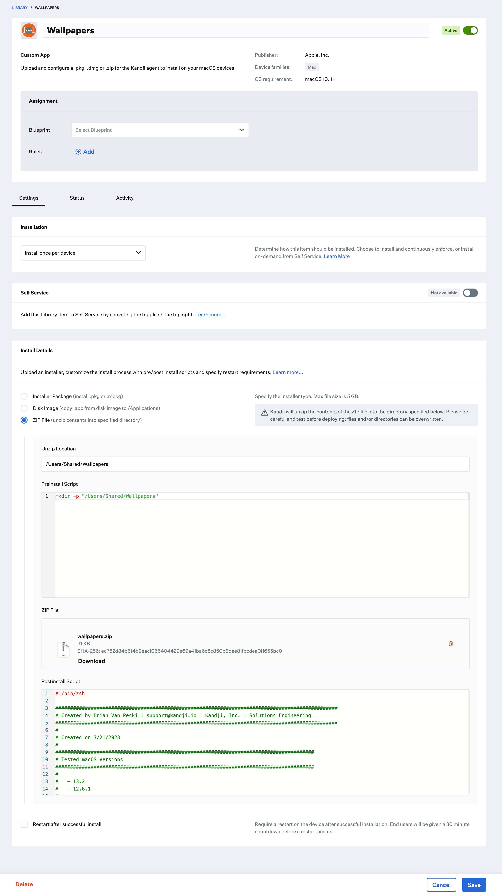

# Set Wallpaper

This script is designed to set a specific image across all connected desktops.
You can run it as a custom script on it's own, or add it as a post-install script to a custom app library item containing your wallpaper images.

Note: If you want to set your Desktop image and lock it in place in order to prevent users from making changes, then you should set it using a configuration profile.
You can use a tool like [iMazing Profile Editor](https://imazing.com/profile-editor).

**Best Practices**
1. Zip up your wallpaper images and deploy them to a folder that will be accessible by all users. (/Users/Shared as an example)
2. Add this script as a postinstall to your custom app library containing your wallpaper images.

### Requirements
In order for this script to set the wallpaper, the Kandji agent needs access to Finder events.

- Privacy Profile (PPPC) granting the Kandji Agent access to Finder Apple Events.
  - **Identifer Type:** Bundle ID
  - **Identifier:** io.kandji.KandjiAgent
  - **Code Requirement:** anchor apple generic and identifier "io.kandji.KandjiAgent" and (certificate leaf[field.1.2.840.113635.100.6.1.9] /* exists */ or certificate 1[field.1.2.840.113635.100.6.2.6] /* exists */ and certificate leaf[field.1.2.840.113635.100.6.1.13] /* exists */ and certificate leaf[subject.OU] = P3FGV63VK7)
  - **App or Service:** AppleEvents
    - **Access:** Allow
    - **Receiver Identifier Type:** Bundle ID
    - **Receiver Identifier:** com.apple.finder
    - **Receiver Code Requirement:** identifier "com.apple.finder" and anchor apple
    

### Custom App Wallpaper Example

