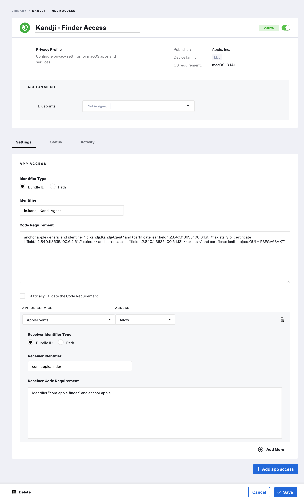

# Set Wallpaper

This script is designed to set a specified image across all connected desktops without requiring the installation of third-party tools or binaries.

You can run it as a custom script or add it as a post-install script to a Custom App Library Item containing your desktop images.

>[!NOTE]
>If you want to set your Desktop image and *lock it in place* to prevent users from making changes, then you should set it [using a configuration profile](https://support.kandji.io/kb/configuring-a-custom-desktop-picture).
You can create that profile with a tool like [iMazing Profile Editor](https://imazing.com/profile-editor).

**Best Practices**
1. Zip up your desktop images and deploy them to a folder that is accessible by all users. (`/Users/Shared/` as an example)
2. Add this script as a post-install to your Custom App Library Item containing your zipped desktop images. (see [example](#custom-app-library-item---wallpaper-example) below)

### Requirements
In order for this script to set the desktop image, the Kandji agent needs access to Finder events.

- Privacy Profile (PPPC) granting the Kandji Agent access to Finder Apple Events.
  - **Identifer Type:** Bundle ID
  - **Identifier:** io.kandji.KandjiAgent
  - **Code Requirement:**
    ```
    anchor apple generic and identifier "io.kandji.KandjiAgent" and (certificate leaf[field.1.2.840.113635.100.6.1.9] /* exists */ or certificate 1[field.1.2.840.113635.100.6.2.6] /* exists */ and certificate leaf[field.1.2.840.113635.100.6.1.13] /* exists */ and certificate leaf[subject.OU] = P3FGV63VK7)
    ```
  - **App or Service:** AppleEvents
    - **Access:** Allow
    - **Receiver Identifier Type:** Bundle ID
    - **Receiver Identifier:** com.apple.finder
    - **Receiver Code Requirement:** identifier "com.apple.finder" and anchor apple
    


### Custom App Library Item - Desktop Image Example

