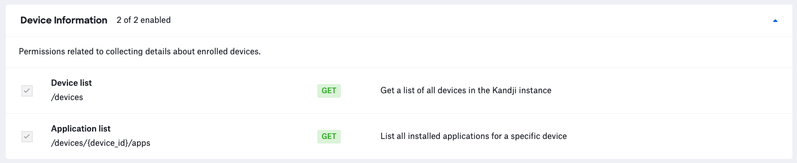

# App Installation Report

### About

This `python3` script leverages the [Kandji API](https://api.kandji.io/#intro) to generate a `CSV` report containing a list of every macOS application recorded by the Kandji Web App. The information includes any application found in the Applications directory on a Mac computer, the application version, and the device serial numbers.

### Kandji API

- See the [Kandji API KB](https://support.kandji.io/api) article to see how to generate an API Token
- The API permissions required to run the reporting script are as follows.

    

### Dependencies

- This script relies on Python 3 to run. Python 3 can be installed directly as an [Auto App](https://updates.kandji.io/auto-app-python-3-214020), from [python.org](https://www.python.org/downloads/), or via [homebrew](https://brew.sh)

- Python dependencies can be installed individually below, or with the included `requirements.txt` file using the following command from a Terminal: `python3 -m pip install -r requirements.txt`

```
python3 -m pip install requests
python3 -m pip install pathlib
```

### Script Modification

- Update the `BASE_URL` variable to match your Kandji web app instance and update `TOKEN` information with your Bearer token.
- Both the `BASE_URL` and `TOKEN` can be found by logging into Kandji then navigate to `Settings > Access > API Token`. From there, you can copy the API URL and generate API tokens.

    ```python
    ########################################################################################
    # Initialize some variables
    # Kandji API base URL
    BASE_URL = "https://example.clients.us-1.kandji.io/api/v1/"
    # Kandji Bearer Token
    TOKEN = "your_api_key_here"
    ########################################################################################
    ```

### Running the Script

1. Copy this script to a common location. i.e. Desktop
2. Launch a Terminal window and navigate to your Desktop using the following command.

    `cd ~/Desktop`

3. Enter the following command in the Terminal window to run the script.

    `python3 app_install_report.py --name Hyper`  

    **Example output**

    ```

    Version: 1.2.0

    Base URL: https://example.clients.us-1.kandji.io/api/v1/

    Getting all device records from Kandji ...
    Total device records: 32
    Looking for devices with Hyper installed...
    Found 13 devices with Hyper installed...
    Generating Kandji app install report ...
    Kandji app report complete ...
    Kandji app report at: /Users/example/hyper_app_install_report_20220512.csv
    ```

4. If the `app_install_report.py` script is executed, a file with the name `hyper_app_install_report_<YYYYMMDD>.csv` will be generated in the current directory, which, in this case would the `Desktop`.

### Examples

- To return all apps installed on all devices, use.

    `python3 app_install_report.py`
