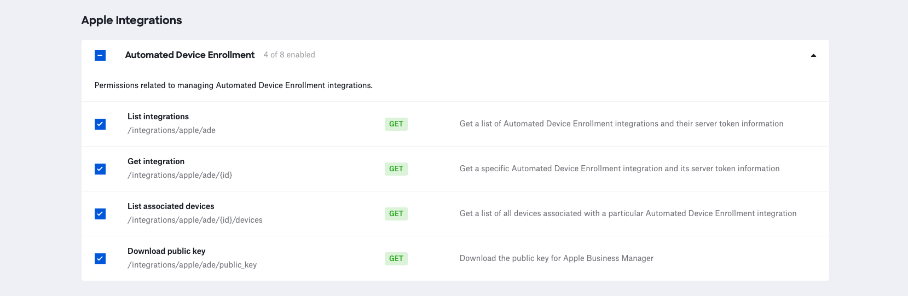

# Apple Integrations

**NOTE**: As with any script please be sure to test with a subset of devices.

### About

This script leverages the Kandji API to interact with Apple Integations API endpoints in a Kandji tenant.

**Note**: at present, this tool has the ability to read information about the Kandji public key used with ABM, existing ADE tokens in Kandji, and devices associated with a given ADE token.

### Kandji API

- The API permissions required to run the reporting script are as follows. Checkout the Kandji [Knowledge Base](https://support.kandji.io) for more information.

    

### Dependencies

- This script relies on Python 3 to run. Python 3 can be installed directly as an [Auto App](https://updates.kandji.io/auto-app-python-3-214020), from [python.org](https://www.python.org/downloads/), or via [homebrew](https://brew.sh)

- Python dependencies can be installed individually below, or with the included `requirements.txt` file using the following command from a Terminal: `python3 -m pip install -r requirements.txt`

```
python3 -m pip install requests
python3 -m pip install pathlib
```

### Script Modification

1. Open the script in a text editor such as BBEdit or VSCode.
1. Update the `SUBDOMAIN` variable to match your Kandji subdomain, the Kandji tenant `REGION`, and update `TOKEN` information with your Bearer token.

    - The `BASE_URL`, `REGION`, and `TOKEN` can be found by logging into Kandji then navigate to `Settings > Access > API Token`. From there, you can copy the information out of the API URL and generate API tokens.
    - For US-based tenants the `REGION` can either be `us` or left as an empty string (`""`)

        *NOTE*: The API token is only visible at the point of creation so be sure to copy it to a safe location.

        ```python
        ########################################################################################
        ######################### UPDATE VARIABLES BELOW #######################################
        ########################################################################################

        SUBDOMAIN = "accuhive"  # bravewaffles, example, company_name

        # us("") and eu - this can be found in the Kandji settings on the Access tab
        REGION = ""

        # Kandji Bearer Token
        TOKEN = ""
        ```

1. Save and close the script.

### Running the Script

1. Copy this script to a common location. i.e. Desktop
2. Launch a Terminal window and navigate to your Desktop using the following command.

    `cd ~/Desktop`

3. Enter the following command in the Terminal window to see script options.

    - `python3 apple_integrations.py --help`

        ```
       usage: apple_integrations.py [-h] [--public-key | --ade-tokens] [--list-devices "1411be7d-xxxx-2f5667c60d42"] [--version]

        Interact with Apple Integrations in a Kandji tenant. Use "--help" to see the able options.
        
        options:
          -h, --help            show this help message and exit
          --public-key          Download the public key to use when adding MDM servers to ABM. 
                                The encoded information will be saved to 
                                a file on the Desktop with the .pem format. This file must be uploaded to ABM manually.
          --ade-tokens          List information about the ADE integrations in a Kandji tenant.
          --list-devices "1411be7d-xxxx-2f5667c60d42"
                                List the devices associated with a given ADE token ID. You can use the "--ade-tokens" option to get a 
                                list of available ADE token IDs.
          --version             Show this tool's version.
        ```

### Examples

- To see information about all ADE integrations.

    ```
    python3 apple_integrations.py --ade-tokens

    Version: 0.0.1
    Base URL: https://accuhive.clients.us-1.kandji.io/api
    
    Getting ade integrations list from Kandji...
    Getting token IDs...
    
    Token 1:
      |
      +-- Token ID: 1411be7d-xxxx-2f5667c60d42
      +-- Server name: server 1
      +-- Total devices: 3
      +-- Last sync: 2022-08-31T21:07:50.296789Z
      +-- Expiration date: 2023-03-11T04:41:43Z
      +-- Days left: 191
      +-- Default blueprint: _testing
    
    
    Token 2:
      |
      +-- Token ID: bb7ad458-xxxx-4b13cf8d61f4
      +-- Server name: server 2
      +-- Total devices: 0
      +-- Last sync: 2022-04-27T18:51:30.560318Z
      +-- Expiration date: 2023-03-11T19:22:18Z
      +-- Days left: 191
      +-- Default blueprint: _testing_apple_silicon
    ```
    
- To see the devices associated with a given ADE token and generate a report, use:

    ```
    python3 apple_integrations.py --list-devices 1411be7d-xxxx-2f5667c60d42

    Version: 0.0.1
    Base URL: https://accuhive.clients.us-1.kandji.io/api
    
    Getting devices associated with token ID "1411be7d-xxxx-2f5667c60d42"...
    Total records: 3
    
    Model                            Serial Number
    ----------------------------------------------
    MacBook Air .................... C02FL5YXQ6LC
    MacBook Air .................... FVHHFKF7Q6L4
    iPad (8th Generation) .......... GG7FF8QSQ1GH
    
    Generating report ...
    Kandji report complete ...
    Kandji report at: /Users/example/1411be7d-xxxx-2f5667c60d42_report_20220831.csv
    ```
