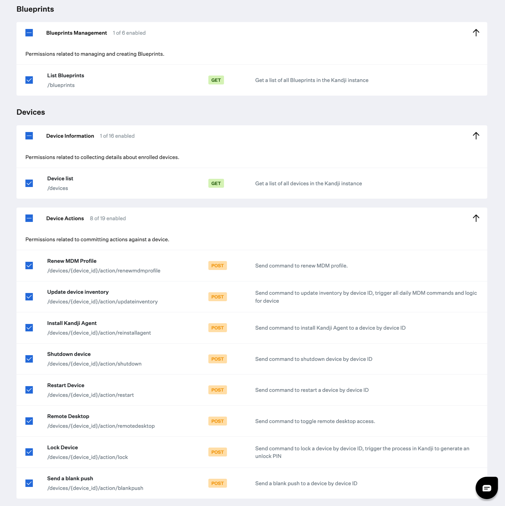

# Device actions

### About

This `python3` script leverages the Kandji API to send actions to one or more device in a Kandji instance. Please your this tools `--help` flag to see all avaialble options.

### Kandji API

- The API permissions required to run the reporting script are as follows. Checkout the Kandji [Knowledge Base](https://support.kandji.io) for more information.

    

### Dependencies

- This script relies on Python 3 to run. Python 3 can be installed directly as an [Auto App](https://support.kandji.io/kb/auto-apps-overview), from [python.org](https://www.python.org/downloads/), or via [Homebrew](https://brew.sh)

- Python dependencies can be installed individually below, or with the included `requirements.txt` file using the following command from a Terminal: `python3 -m pip install -r requirements.txt`

```
python3 -m pip install requests
python3 -m pip install pathlib
```

### Script Modification

1. Open the script in a text editor such as BBEdit or VSCode.
1. Update the `SUBDOMAIN` variable to match your Kandji subdomain, the Kandji tenant `REGION`, and update `TOKEN` information with your Bearer token.

    - The `BASE_URL`, `REGION`, and `TOKEN` can be found by logging into Kandji then navigate to `Settings > Access > API Token`. From there, you can copy the information out of the API URL and generate API tokens.
    - For US-based tenants the `REGION` can either be `us` or left as an empty string (`""`)

        *NOTE*: The API token is only visible at the point of creation so be sure to copy it to a safe location.

        ```python
        ########################################################################################
        ######################### UPDATE VARIABLES BELOW #######################################
        ########################################################################################

        SUBDOMAIN = "accuhive"  # bravewaffles, example, company_name

        # us("") and eu - this can be found in the Kandji settings on the Access tab
        REGION = ""

        # Kandji Bearer Token
        TOKEN = ""
        ```

1. Save and close the script.

### Running the Script

1. Copy this script to a common location. i.e. Desktops
2. Launch a Terminal window and navigate to your Desktop using the following command.

    `cd ~/Desktop`

3. Enter the following command in the Terminal window to see script options.

    `python3 device_actions.py --help`

    ```text
    usage: device_actions.py [-h] (--blankpush | --lock | --reinstall-agent | --remote-desktop [on|off] | --renew-mdm | --restart | --shutdown | --update-inventory) (--serial-number XX7FFXXSQ1GH | --blueprint [blueprint_name] | --platform [Mac|iPhone|iPad|AppleTV] | --all-devices) [--version]

    Send device actions to one or more devices in a Kandji instance.

    options:
    -h, --help            show this help message and exit
    --version             Show this tool's version.

    Device actions:
    --blankpush           Initiate a blank push. A Blank Push utilizes the same service that sends 
                          MDM profiles and commands. It's meant for verifying a connection to APNs, 
                          but it sometimes helps to get pending push notifications that are stuck 
                          in the queue to complete.
    --lock                Initiate a device lock. For macOS, to see the device lock PIN, check the  
                          device record page in Kandji.
    --reinstall-agent     Reinstall the Kandji agent on a macOS device.
    --remote-desktop [on|off]
                          This action with send an MDM command to set macOS remote desktop to on or off remoted desktop for macOS. If Remote Management is already disabled on a device, sending the off option will result in a "Command is not allowed for current device" message to be returned from Kandji and the
                          command will not be sent.
    --renew-mdm           Re-install the existing root MDM profile for a given device ID. This  
                          command will not impact any existing configurations, apps, or profiles.
    --restart             Remotely restart a device.
    --shutdown            Shutdown a device.
    --update-inventory    This action sends a few MDM commands to start a check-in for a device,    
                          initiating the daily MDM commands and MDM logic. MDM commands sent with 
                          this action include: AvailableOSUpdates, DeviceInformation, SecurityInfo, 
                          UserList, InstalledApplicationList, ProfileList, and CertificateList.

    Search options:
    --serial-number XX7FFXXSQ1GH
                          Look up a device by its serial number and send an action to it.
    --blueprint [blueprint_name]
                          Send an action to devices in a specific blueprint in a Kandji instance. 
                          If this option is used, you will see a prompt to comfirm the action and 
                          will be required to enter a code to continue.
    --platform [Mac|iPhone|iPad|AppleTV]
                          Send an action to a specific device family in a Kandji instance. If this 
                          option is used, you will see a prompt to comfirm the action and will be 
                          required to enter a code to continue.
    --all-devices         Send an action to all devices in a Kandji instance. If this option is 
                          used, you will see a prompt to comfirm the action and will be required to 
                          enter a code to continue.
    ```

### Examples

- Send an action to one device.

    `python3 device_actions.py --blankpush --serialnumber XX7FFXXSQ1GH`

- Send an action to turn on Remote Desktop on a Mac.

    `python3 device_actions.py --remote-desktop on --serialnumber XX7FFXXSQ1GH`

- Send an action to all devices of a specific type

    `python3 device_actions.py --blankpush --platform iPhone`

- Send an action to all devices.

    **NOTE**: For this command to work you will be required to confirm and enter a randomly generated code before the script will continue.

    `python3 device_actions.py --blankpush --all-devices`

    **Example output**

    ```sh
    Script Version: 0.0.6
    Base URL: https://accuhive.api.kandji.io/api

    The blankpush command will go out to ALL devices in the Kandji instance...
    This is NOT reversable. Are you sure you want to do this? Type "Yes" to continue: y

            Code: 7138
            Please enter the code above: 7138

    Code verification complete.
    ```
