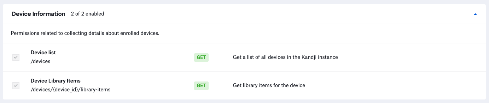

# Device Library Items

**NOTE**: As with any script please be sure to test with a subset of devices.

### About

This script leverages the Kandji API to generate a CSV report containing information about a specific library item or all library items scoped to devices in the Kandji tenant.


### Kandji API

- The API permissions required to run the reporting script are as follows. Checkout the Kandji [Knowledge Base](https://support.kandji.io) for more information.

    

### Dependencies

- This script relies on Python 3 to run. Python 3 can be installed directly as an [Auto App](https://updates.kandji.io/auto-app-python-3-214020), from [python.org](https://www.python.org/downloads/), or via [homebrew](https://brew.sh)

- Python dependencies can be installed individually below, or with the included `requirements.txt` file using the following command from a Terminal: `python3 -m pip install -r requirements.txt`

    ```
    python3 -m pip install requests
    python3 -m pip install pathlib
    ```

### Script Modification

1. Open the script in a text editor such as BBEdit, Atom, or VSCode.
1. Update the `BASE_URL` variable to match your Kandji web app instance and update `TOKEN` information with your Bearer token.

    - The `BASE_URL`, `REGION`, and `TOKEN` can be found by logging into Kandji then navigate to `Settings > Access > API Token`. From there, you can copy the information out of the API URL and generate API tokens.

        *NOTE*: The API token is only visible at the point of creation so be sure to copy it to a safe location.

        ```python
        ##############################################################################################
        ######################### UPDATE VARIABLES BELOW #############################################
        ##############################################################################################

        SUBDOMAIN = "accuhive"  # bravewaffles, example, company_name
        REGION = "us"  # us and eu - this can be found in the Kandji settings on the Access tab within
                       # the API URL.

        # Kandji Bearer Token
        TOKEN = "your_api_key_here"
        ```

1. Save and close the script.

### Running the Script

1. Copy the script to a common location. i.e. the Desktop folder.
1. Launch a Terminal window and navigate to your Desktop using the following command.

    `cd ~/Desktop`

1. Enter the following command to run the script. In the example below `Hyper` is the Kandji library item name that we are searching for.

    `python3 device_library_items.py --library-item "Hyper"`

    **Example Script Output**

    ```
    python3 device_library_items.py --library-item "Hyper"

    Running: Library items Report ...
    Version: 1.1.0

    Base URL: https://example.clients.us-1.kandji.io/api/v1/

    Looking for devices with the "hyper" library item assigned...
    Getting device inventory from Kandji...
    Total records: 37

    Total device records: 37
    Found 28 devices with hyper assigned...
    Generating LIT report...
    Kandji report at: /Users/example/hyper_lit_report_20220512.csv
    ```

1. Once complete a report will be generated and placed in the directory where the script was executed.

    The name of the report is in the format `<item_name>_lit_report_<todays_date>.csv`

    Example: `hyper_lit_report_20210916.csv`


### Examples

- Generate a report containing Mac devices that have the app Hyper installed.

    `python3 device_library_items.py --library-item "Hyper" --platform "Mac"`

- Generate a report containing all library items scoped to all Mac devices.

    `python3 device_library_items.py --all-lit --platform "Mac"`

- Generate a report containing all library items scoped to all devices.

    `python3 device_library_items.py --all-lit`

- See additional help info by entering the following command in Terminal.

    `python3 device_library_items.py --help`

    ```
    usage: device_library_items [-h] [--platform "Mac"] [--library-item "Google Chrome" | --all-lit] [--version]

    Get a report containing information for a given library item or all library items for all devices.
    
    options:
      -h, --help            show this help message and exit
      --platform "Mac"      Enter a specific device platform type. This will limit the search results to only the specified platform. 
                            Examples: Mac, iPhone, iPad, AppleTV. Ether the --library-item or --all-lit options must also be specified 
                            if the --platform is used.
      --library-item "Google Chrome", --lit "Google Chrome"
                            Enter the name of a specific Kandji library item. Cannot be used together with the --all-lit option
      --all-lit             Use this option to return all library items for all devices. Cannot be used together with the --library-
                            item option.
      --version             Show this tool's version.
    ```
