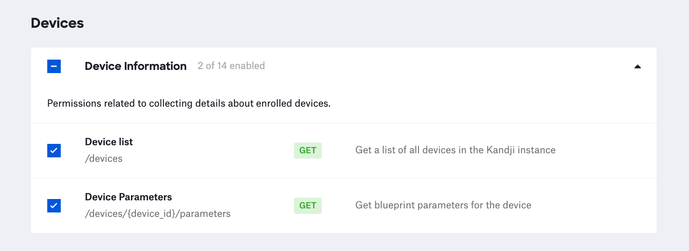

# Devices Parameters

**NOTE**: As with any script please be sure to test test test.

### About

These `python3` scripts leverage the Kandji API to interact with and generate reports from the device parameters endpoint.

### Kandji API

- The API permissions required to run the reporting script are as follows. Checkout the Kandji [Knowledge Base](https://support.kandji.io) for more information.

    

### Dependencies

- This script relies on Python 3 to run. Python 3 can be installed directly as an [Auto App](https://updates.kandji.io/auto-app-python-3-214020), from [python.org](https://www.python.org/downloads/), or via [homebrew](https://brew.sh)

- Python dependencies can be installed individually below, or with the included `requirements.txt` file using the following command from a Terminal: `python3 -m pip install -r requirements.txt`

    ```
    python3 -m pip install requests
    python3 -m pip install pathlib
    ```

### Script Modification

1. Open the script in a text editor such as BBEdit or VSCode.
1. Update the `SUBDOMAIN` variable to match your Kandji subdomain, the Kandji tenant `REGION`, and update `TOKEN` information with your Bearer token.

    - The `BASE_URL`, `REGION`, and `TOKEN` can be found by logging into Kandji then navigate to `Settings > Access > API Token`. From there, you can copy the information out of the API URL and generate API tokens.
    - For US-based tenants the `REGION` can either be `us` or left as an empty string (`""`)

        *NOTE*: The API token is only visible at the point of creation so be sure to copy it to a safe location.

        ```python
        ########################################################################################
        ######################### UPDATE VARIABLES BELOW #######################################
        ########################################################################################

        SUBDOMAIN = "accuhive"  # bravewaffles, example, company_name

        # us("") and eu - this can be found in the Kandji settings on the Access tab
        REGION = ""

        # Kandji Bearer Token
        TOKEN = ""
        ```

1. Save and close the script.

1. Save and close the script.

### Running the Scripts

1. Copy this script to a common location. i.e. Desktop
2. Launch a Terminal window and navigate to your Desktop using the following command.

    `cd ~/Desktop`

3. Enter the following command in the Terminal window to run the script.

    `python3 parameters.py`
    
    **Example output**
    
    ```
    Base URL: https://mattwilson.clients.us-1.kandji.io/api
    
    Getting device inventory from Kandji...
    Total records returned: 40
    
    Total devices with parameters assigned: 38
    Generating device report...
    Kandji report at: /Users/example/Desktop/device_params_report_20220901.csv
    ```

4. If the `parameters.py ` script is executed, a file with the name `device_params_report_<YYYYMMDD>.csv` will be generated in the current directory, which, in this case would be the `Desktop`.

