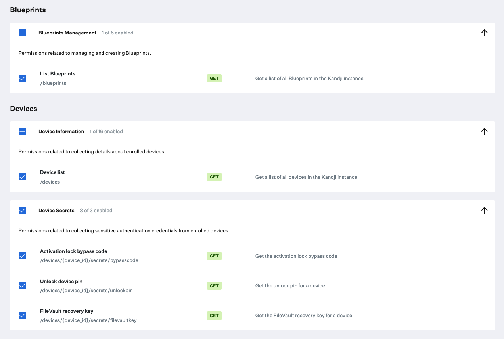

# Device secrets

### About

This `python3` script leverages the Kandji API to return device secrets about one or more device in a Kandji instance. Generates a csv file. Please see this tools `--help` option for all avaialble options.

### Kandji API

The API permissions required to run the reporting script are as follows. Checkout the Kandji [Knowledge Base](https://support.kandji.io) for more information.



### Dependencies

- This script relies on Python 3 to run. Python 3 can be installed directly as an [Auto App](https://support.kandji.io/kb/auto-apps-overview), from [python.org](https://www.python.org/downloads/), or via [Homebrew](https://brew.sh)

- Python dependencies can be installed individually below, or with the included `requirements.txt` file using the following command from a Terminal: `python3 -m pip install -r requirements.txt`

    ```
    python3 -m pip install requests
    python3 -m pip install pathlib
    ```

### Script Modification

1. Open the script in a text editor such as BBEdit, Atom, or VSCode.
1. Update the `SUBDOMAIN` variable to match your Kandji subdomain, the Kandji tenant `REGION`, and update `TOKEN` information with your Bearer token.

- The `BASE_URL`, `REGION`, and `TOKEN` can be found by logging into Kandji then navigate to `Settings > Access > API Token`. From there, you can copy the information out of the API URL and generate API tokens.

    *NOTE*: The API token is only visible at the point of creation so be sure to copy it to a safe location.

    ```python
    ########################################################################################
    ######################### UPDATE VARIABLES BELOW #######################################
    ########################################################################################
    
    SUBDOMAIN = "accuhive"  # bravewaffles, example, company_name
    
    # us("") and eu - this can be found in the Kandji settings on the Access tab
    REGION = ""
    
    # Kandji Bearer Token
    TOKEN = ""
    ```

1. Save and close the script.

### Running the Script

1. Copy this script to a common location. i.e. Desktops
2. Launch a Terminal window and navigate to your Desktop using the following command.

    `cd ~/Desktop`

3. Enter the command `python3 device_secrets.py --help` in the Terminal window to see script options.

    ```text
    usage: device_secrets.py [-h] [--filevault] [--pin] [--albc] [--recovery] (--serial-number XX7FFXXSQ1GH | 
    --blueprint [blueprint_name] | --platform [Mac|iPhone|iPad|AppleTV] | --all-devices) [--version]

    Get device secrets from a Kandji instance.
    
    options:
      -h, --help            show this help message and exit
      --version             Show this tool's version.
    
    Device secrets:
      The following option can be used to return device secrets. Multiple options can be 
      combined together.
    
      --filevault           Return the FileVault recovery key. Only for macOS.
      --pin                 Return the unlockpin
      --albc                Return the device-based and user-based activation lock bypass codes.
      --recovery            Return the device recovery key that is configured by the Recovery Password library item.
    
    
    Search options:
      A search can be limited to a specific device, blueprint, or an entire device platform.
    
      --serial-number XX7FFXXSQ1GH
                            Look up a device by its serial number and send an action to it.
      --blueprint [blueprint_name]
                            Send an action to devices in a specific blueprint in a Kandji instance. 
                            If this option is used, you will see a prompt to comfirm the action 
                            and will be required to enter a code to continue.
      --platform [Mac|iPhone|iPad|AppleTV]
                            Send an action to a specific device family in a Kandji instance. If 
                            this option is you will see a prompt to comfirm the action and will 
                            be required to enter a code to continue.
      --all-devices         Send an action to all devices in a Kandji instance. If this option 
                            is used, you will see a prompt to comfirm the action and will be 
                            required to enter a code to continue.
    ```

### Examples

- Get the FileVault key, Unlock pin, user activation lock code, device activation lock code and Recovery Key for all devices that have them in the `Mac` blueprint. Keep in mind that if your Blueprint name contains capital letters or spaces, you will need to enclose it in quotation marks.

    `python3 device_secrets.py --filevault --pin --albc --recovery --blueprint "Mac"`

    Example output
    
    ```text
    Version: 0.0.6
    Base URL: https://accuhive.api.kandji.io/api
    
    Found blueprint matching the name "Mac"...
    Getting device inventory from Kandji...
    Total records returned: 19
    Secrets query: FileVault Key, Unlock PIN, Bypass Codes, Recovery Key
    Running query...hang tight.
    Total records in report: 19
    Generating device report...
    Kandji report at: /Users/testuser/Desktop/filevaultkey_unlockpin_bypasscode_mac_secrets_report_20230408.csv
    ```
