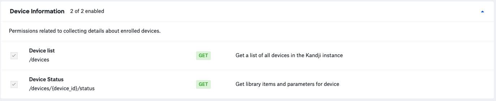

# Status Report

**NOTE**: As with any script please be sure to test test test.

### About

This script leverages the Kandji API to generate a CSV report containing the installation status of a specified library item or parameter.

### Kandji API

- The API permissions required to run the reporting script are as follows. Checkout the Kandji [Knowledge Base](https://support.kandji.io) for more information.

    

### Dependencies

- This script relies on Python 3 to run. Python 3 can be installed directly as an [Auto App](https://updates.kandji.io/auto-app-python-3-214020), from [python.org](https://www.python.org/downloads/), or via [homebrew](https://brew.sh)

- Python dependencies can be installed individually below, or with the included `requirements.txt` file using the following command from a Terminal: `python3 -m pip install -r requirements.txt`

```
python3 -m pip install requests
python3 -m pip install pathlib
```

### Script Modification

1. Open the script in a text editor such as BBEdit, Atom, or VSCode.
1. Update the `BASE_URL` variable to match your Kandji web app instance and update `TOKEN` information with your Bearer token.

    - The `SUBDOMAIN `, `REGION`, and `TOKEN` can be found by logging into Kandji then navigate to `Settings > Access > API Token`. From there, you can copy the information out of the API URL and generate API tokens.

        *NOTE*: The API token is only visible at the point of creation so be sure to copy it to a safe location.

        ```python
        ##############################################################################################
        ######################### UPDATE VARIABLES BELOW #############################################
        ##############################################################################################

        SUBDOMAIN = "accuhive"  # bravewaffles, example, company_name
        REGION = "us"  # us and eu - this can be found in the Kandji settings on the Access tab within
                       # the API URL.

        # Kandji Bearer Token
        TOKEN = "your_api_key_here"
        ```

1. Save and close the script.

### Running the Script

1. Copy the script to a common location. i.e. the Desktop folder.
1. Launch a Terminal window and navigate to your Desktop using the following command.

    `cd ~/Desktop`

1. Enter the following to run the script.

    `python3 status_report.py --item-name "Firefox"` or `python3 status_report.py --parameter-name "Set Computer Name"`

    **Example Script Output**

    ```
    python3 status_report.py --lit "Homebrew"

    Version: 1.0.1
    Base URL: https://mattwilson.clients.us-1.kandji.io/api
    
    Getting device inventory from Kandji...
    Total records: 40
    
    Looking for the status of "Homebrew" ...
    Found 35 devices with Homebrew assigned ...
    Generating Homebrew status report ...
    Kandji report complete ...
    Kandji report at: /Users/example/Desktop/homebrew_status_report_20220901.csv 
    ```

1. Once complete a report will be generated and placed in the directory where the script was executed.

    The name of the report is in the format `<item_name>_status_report_<todays_date>.csv`

    Example: `homebrew_status_report_20220901.csv`


### Extra

You can see additional help info by entering the following command in Terminal.

`python3 status_report.py --help`

```
usage: status_report [-h] [--library-item "Google Chrome"] [--parameter "Set Computer Name"] [--version]

Get the status report for a given library item or parameter leveraging the Kandji API.

options:
  -h, --help            show this help message and exit
  --library-item "Google Chrome", --lit "Google Chrome"
                        Enter the name of the Kandji library item.
  --parameter "Set Computer Name", --param "Set Computer Name"
                        Enter the name of the Parameter.
  --version             Show this tool's version.
```
