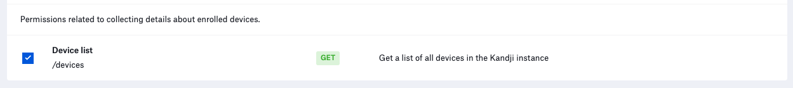

# Devices Report

**NOTE**: As with any script please be sure to test with a subset of devices.

### About

This `python3` script leverages the [Kandji API](https://api.kandji.io/#intro) to generate a device report based on the GET Devices API endpoint for all devices in a Kandji tenant.

### Kandji API

- See the [Kandji API KB](https://support.kandji.io/api) article to see how to generate an API Token
- The API permissions required to run the reporting script are as follows.

    

### Dependencies

- This script relies on Python 3 to run. Python 3 can be installed directly as an [Auto App](https://updates.kandji.io/auto-app-python-3-214020), from [python.org](https://www.python.org/downloads/), or via [homebrew](https://brew.sh)

- Python dependencies can be installed individually below, or with the included `requirements.txt` file using the following command from a Terminal: `python3 -m pip install -r requirements.txt`

    ```
    python3 -m pip install requests
    python3 -m pip install pathlib
    ```

### Script Modification

1. Open the script in a text editor such as BBEdit or VSCode.
1. Update the `SUBDOMAIN` variable to match your Kandji subdomain, the Kandji tenant `REGION`, and update `TOKEN` information with your Bearer token.

    - The `BASE_URL`, `REGION`, and `TOKEN` can be found by logging into Kandji then navigate to `Settings > Access > API Token`. From there, you can copy the information out of the API URL and generate API tokens.
    - For US-based tenants the `REGION` can either be `us` or left as an empty string (`""`)

        *NOTE*: The API token is only visible at the point of creation so be sure to copy it to a safe location.

        ```python
        ########################################################################################
        ######################### UPDATE VARIABLES BELOW #######################################
        ########################################################################################

        SUBDOMAIN = "accuhive"  # bravewaffles, example, company_name

        # us("") and eu - this can be found in the Kandji settings on the Access tab
        REGION = ""

        # Kandji Bearer Token
        TOKEN = ""
        ```

1. Save and close the script.

1. Save and close the script.

### Running the Script

1. Copy this script to a common location. i.e. Desktop
2. Launch a Terminal window and navigate to your Desktop using the following command.

    `cd ~/Desktop`

3. Enter the following command in the Terminal window to run the script. This will generate a devices report for all Mac in the Kandji tenant.

    `python3 devices_report.py --platform Mac`

    **Example output**

    ```
    Running: Device Report ...
    Version: 1.1.0

    Base URL: https://accuhive.api.kandji.io/api

    Getting device inventory from Kandji...
    Total records returned: 54

    Generating device report for the following devices ...
    Kandji report complete ...
    Kandji report at: /Users/example/Desktop/mac_report_20220512.csv
    ```

4. If the `devices_report.py` script is executed, a file with the name `mac_devices_report_<YYYYMMDD>.csv` will be generated in the current directory, which, in this case would be the `Desktop`.

#### Examples

- To generate a report of all devices, use the following command.

    `python3 devices_report.py`

- To see help information: `python3 devices_report.py --help`

    ```sh
    usage: devices_report [-h] [--platform [Mac|iPhone|iPad|AppleTV]] [--version]

    This tool is used to generate a device report based on the GET Devices API endpoint for all devices in a Kandji tenant. If you're looking for more information about your devices, see the device_details script.

    options:
    -h, --help            show this help message and exit
    --platform [Mac|iPhone|iPad|AppleTV]
                            Enter a specific device platform type. This will limit the search results to only the specified platfrom. Examples: Mac, iPhone, iPad, AppleTV.
    --version             Show this tool's version.
    ```
