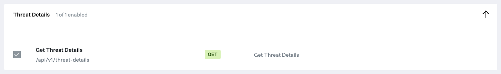

# Threats

### About

This `python3` script utilizes the Kandji API to fetch and generate detailed reports regarding threats detected across devices in a Kandji tenant. It enables filtering based on threat classification, status, device ID, and date range to provide targeted insights into the security posture of managed devices.

For more information on the Threats endpoint, see the [**Kandji API Docs**](https://api-docs.kandji.io/#d041043a-ea47-47d5-b6f1-234ef422494d)

### Kandji API

- The necessary API permissions for executing this script are outlined below. For more information on API access, refer to the Kandji [Knowledge Base](https://support.kandji.io).

  

### Dependencies

- The script requires Python 3. You can install Python 3 directly as an [Auto App](https://updates.kandji.io/auto-app-python-3-214020), from [python.org](https://www.python.org/downloads/), or via [Homebrew](https://brew.sh) on macOS.

- Required Python modules can be installed using the command below. This assumes the presence of a `requirements.txt` file listing `requests` and any other required libraries.

  ```sh
  python3 -m pip install -r requirements.txt
  ```

  If installing manually:

  ```sh
  python3 -m pip install requests pathlib
  ```

### Script Modification

1. Open the script in a text editor such as BBEdit or VSCode.
2. Update the `SUBDOMAIN` variable to match your Kandji subdomain, the Kandji tenant `REGION`, and update `TOKEN` information with your Bearer token.

   - The `BASE_URL`, `REGION`, and `TOKEN` can be found by logging into Kandji then navigate to `Settings > Access > API Token`. From there, you can copy the information out of the API URL and generate API tokens.
   - For US-based tenants the `REGION` can either be `us` or left as an empty string (`""`)

     _NOTE_: The API token is only visible at the point of creation so be sure to copy it to a safe location.

     ```python
     ########################################################################################
     ######################### UPDATE VARIABLES BELOW #######################################
     ########################################################################################

     SUBDOMAIN = "accuhive"  # bravewaffles, example, company_name

     # us("") and eu - this can be found in the Kandji settings on the Access tab
     REGION = ""

     # Kandji Bearer Token
     TOKEN = ""
     ```

3. Save and close the script.

### Running the Script

1. Place the script in a suitable directory, for example, your Desktop.
2. Open a Terminal and navigate to the directory containing the script.

   ```sh
   cd ~/Desktop
   ```

3. To view available command options, execute:

   ```sh
   python3 threats.py --help
   ```

   You'll see options related to threat classification, date range, device ID, and status filters.

   ```sh
   usage: threats.py [-h] [--classification CLASSIFICATION] [--date-range DATE_RANGE] [--device-id DEVICE_ID] [--status STATUS] [--version]

   Fetch and report Kandji threat details.

   options:
     -h, --help            show this help message and exit
     --classification CLASSIFICATION
                           Filter by threat classification (malware, pup).
     --date-range DATE_RANGE
                           Filter by number of days (e.g., 7, 30, 90).
     --device-id DEVICE_ID
                           Filter by specific device ID.
     --status STATUS       Filter by threat status (quarantined, not_quarantined, released).
     --version             Show script version.
   ```

### Examples

- Generate a report for malware threats detected within the last 30 days:

  ```sh
  python3 threats_report.py --classification malware --date-range 30
  ```

- Generate a report for all threats that have been quarantined:

  ```sh
  python3 threats_report.py --status quarantined
  ```

- Generate a comprehensive report without filters, detailing all identified threats:

  ```sh
  python3 threats_report.py
  ```

A CSV report named `threats_report_<current_date>.csv` will be generated in the directory from which the script is run, offering insights into the threats detected by Kandji within the specified parameters.

### Note

This script was written by [@TheBoatyMcBoatFace](https://github.com/TheBoatyMcBoatFace) on behalf of [@CivicActions](https://github.com/CivicActions) in March of 2024. We used portions of the various scripts in the [Kandji Support](https://github.com/kandji-inc/support) repo to accomplish this.
