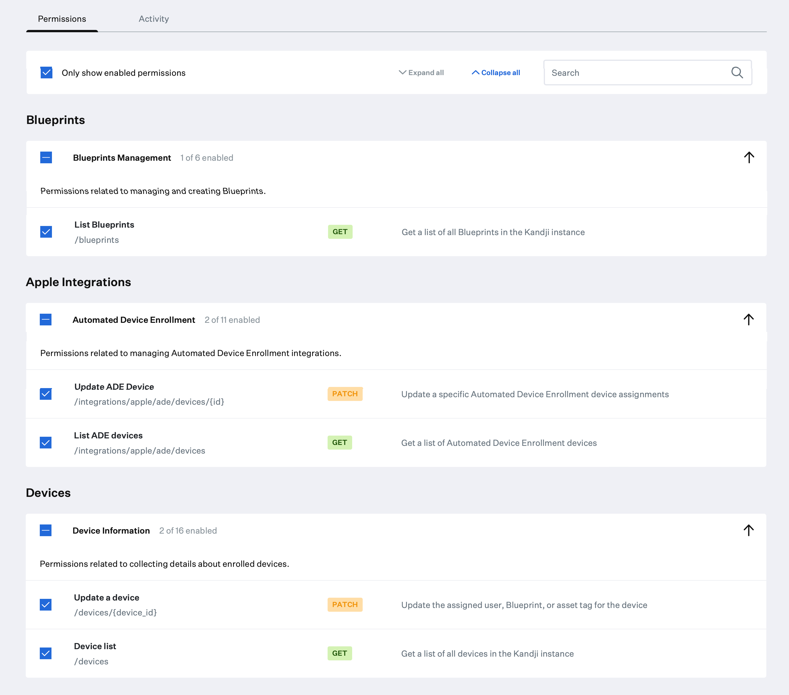

# Update Device Record

**NOTE**: As with any script please be sure to test with a subset of devices.

### About

This script leverages the Kandji API along with a `CSV` input file to update one or more device inventory records.

An example input file can be found in this repo.

### Kandji API

- The API permissions required to run the reporting script are as follows. Checkout the Kandji [Knowledge Base](https://support.kandji.io) for more information.

    

### The following fields can be updated via the Kandji API

- **Blueprint** - Enter the Blueprint name in the input file as it appears in Kandji.
- **Asset tag**
- **User** - The assigned User can be updated if a Directory Services has been integrated with Kandji and the User exists in the Kandji console. The Kandji user ID Number must be used in the input file.

    Use the following steps to find the Kandji user ID number:

    1. Log in to the Kandji web app
    2. Go to the Users module
    3. Select a User
    4. Copy the ID out of the address bar. It should be similar to ".../users/all/`53`" where `53` is the Kandji user ID. (**NOTE**: This process will become easier in a future update)

### Dependencies

- This script relies on Python 3 to run. Python 3 can be installed directly as an [Auto App](https://updates.kandji.io/auto-app-python-3-214020), from [python.org](https://www.python.org/downloads/), or via [homebrew](https://brew.sh)

- Python dependencies can be installed individually below, or with the included `requirements.txt` file using the following command from a Terminal: `python3 -m pip install -r requirements.txt`

    ```
    python3 -m pip install requests
    python3 -m pip install pathlib
    ```

### Script Modification

1. Open the script in a text editor such as BBEdit, Atom, or VSCode.
1. Update the `BASE_URL` variable to match your Kandji web app instance and update `TOKEN` information with your Bearer token.

    - The `BASE_URL`, `REGION`, and `TOKEN` can be found by logging into Kandji then navigate to `Settings > Access > API Token`. From there, you can copy the information out of the API URL and generate API tokens.

        *NOTE*: The API token is only visible at the point of creation so be sure to copy it to a safe location.

        ```python
        ##############################################################################################
        ######################### UPDATE VARIABLES BELOW #############################################
        ##############################################################################################

        SUBDOMAIN = "accuhive"  # bravewaffles, example, company_name
        REGION = "us"  # us and eu - this can be found in the Kandji settings on the Access tab within
                       # the API URL.

        # Kandji Bearer Token
        TOKEN = "your_api_key_here"
        ```

1. Save and close the script.
### Running the Script

1. Copy the script and input file to a common location. i.e. Desktop
2. Add the serial numbers for which you would like to update records.
3. Enter the Blueprint ID, Asset Tag, and User ID number if applicable.
4. Launch a Terminal window and navigate to your Desktop using the following command.

    `cd ~/Desktop`

5. Enter the following to run the script.

    `python3 update_device_record.py --input-file "/path/to/input_template.csv"`
    
    **Example output**
    
    ```
    Version: 1.3.0
    Base URL: https://accuhive.clients.us-1.kandji.io/api
    
    Found input file: /path/to/input_template.csv
    Checking the input file for duplicate serial_number entries...
    Total unique serial_numbers in the input file: 4
    
    Looking for C02J7929G1HW ...
    Building request payload ...
    Looking for "_testing_blueprint" blueprint ...
    WARNING: _testing_blueprint not found...
    WARNING: Check the name and try again...
    WARNING: Will not attempt to update record...
    
    Looking for C02FL5YXQ6LC ...
    Building request payload ...
    Looking for "_testing_apple_silicon" blueprint ...
    Request payload: {"blueprint_id": "97e4e175-1631-43f6-a02b-33fd1c748ab8", "asset_tag": "bee-have"}
    Attempting to update device record...
    Record updated
    
    Looking for C02J202CG1HW ...
    Building request payload ...
    Looking for "_testing" blueprint ...
    Request payload: {"blueprint_id": "ee0c13ff-90ca-48c5-9b4c-7bc4b9cb89fe", "asset_tag": "444444"}
    Attempting to update device record...
    Record updated
    
    Looking for VM8gRmR1qqab ...
    WARNING: VM8gRmR1qqab not found...
    
    Finished ...
    ```

    **NOTE**: You can enter the path to the input file manually or you can drag the file from your Finder window directly into the Terminal window.


### Extra

You can see additional help info by using the `--help` flag below.

`python3 update_device_record.py --help`


```
usage: update_device_record [-h] --input-file "/path/to/input_template.csv" [--version]

Update device inventory information with a CSV input file and the Kandji Enterprise API.

optional arguments:
  -h, --help            show this help message and exit
  --input-file "/path/to/input_template.csv"
                        Enter the path to the spreadsheet(CSV file) or drag the file into this
                        Terminal window. An example input file template can be found in this repo.
  --version             Show this tool's version.
```
